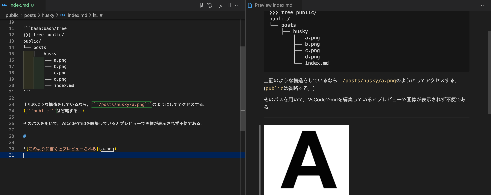

# 今回の課題

nextjsでは，画像のパスを```public/```の中をデフォルトで探しにいく．

```bash:bash/tree
❯❯❯ tree public/
public/
└── posts
    ├── husky
        ├── a.png
        ├── b.png
        ├── c.png
        ├── d.png
        └── index.md
```

上記のような構造をしているなら，```/posts/husky/a.png```のようにしてアクセスする．
(```public```は省略する．)

そのパスを用いて，VsCodeでmdを編集しているとプレビューで画像が表示されず不便である．

```md:markdown

```


```md:markdown

```


問題点として，プレビューされる形式で記述するとnextjsの記法に反してしまい，本番環境に反映されないということ．

# 解決策 husky

解決策として，huskyを用いて```git commit```の直前にnextjsの記法に修正するという方針を採用した．

## [husky](https://github.com/typicode/husky)とは

```git  commit```,```git push```の直前に任意のコマンドを実行できるツール．

普通は，commitの前にlintやtestを走らせるといった使い方をする．

## インストール

```bash:bash
❯❯❯ yarn add -D husky
❯❯❯ npx husky-init
```

これで，```.husky/pre-commit```というが作成される．
このファイルがcommit前に実行される．

```sh:pre-commit
#!/bin/sh
. "$(dirname "$0")/_/husky.sh"

python3 ./utils/convert_link.py
```

## 勘違い

commitの前にmdを書き換えても意味がないことに気づいてしまった，，，

huskyには，```pre-add```というhookはないようなので，無理やり方針を変える．

## 新しい方針

苦肉の策だが，```package.json```のscriptでリンクの修正と```git add```を同時に行うこととした．

```js:package.json
{
"scripts": {
    "ga": "python3 ./utils/convert_link.py && git add ."
  },
}
```

## conver_link.py

```python:utils/conver_link.py
import glob
import re

files = glob.glob("./public/posts/*/*.md")

regexp = r"./public(.*/)*.*.md"

for file in files:
    res = re.match(regexp, file)
    dirpath = res.groups()[0]
    with open(file, 'r') as f:
        lines = f.readlines()
        for line in lines:
            res = re.match(r"!\[(.*)\]\((.*)\)", line)
            if res:
                alt = res.groups()[0]
                img_path = res.groups()[1]
                if not img_path[0] == '/':
                    new_line = f"\n"
                    lines[lines.index(line)] = new_line
    with open(file, 'w') as f:
        f.writelines(lines)
```

全てのmdファイルに対して，確認を行なってしまっているので冗長な気がする．

要改善案．．．

# おわりに

今回は，nextjsとmdの記法の差異を```package.json```のscriptを用いて解決した??

```husky```についても学ぶことができたのでギリギリセーフということで😅
